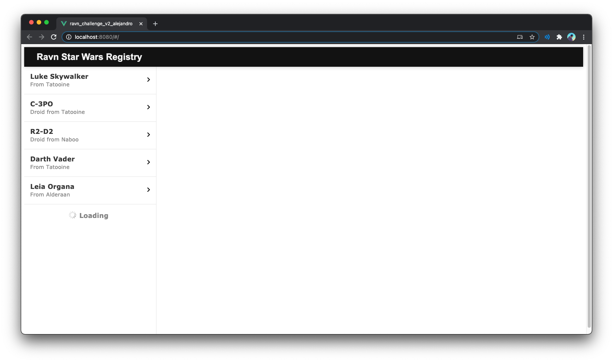
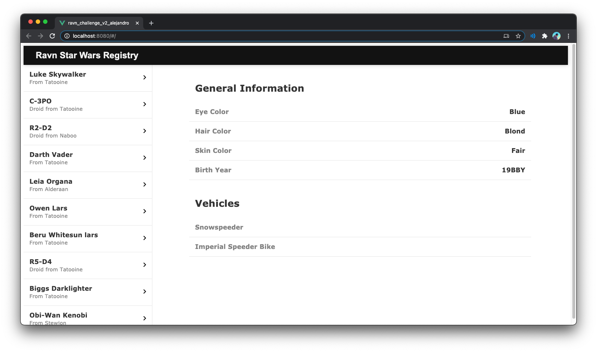

# Ravn GraphQL Challenge V2 - Star Wars GraphQL API


Web app written in Vue.js that allows you to browse the [Star Wars GraphQL API](https://swapi-graphql.netlify.app/.netlify/functions/index) using the Apollo Client in order to show information about characters of the Star Wars Saga.

## Requirements
- Node.js with npm

## Project setup

### Clone the repo
```
https://github.com/lamlemonpie/Ravn-Challenge-V2-AlejandroLarraondo.git
```

### Install the project
```
npm install
```

### Run the project
```
npm run serve
```

### The project normally executes under
```
http://localhost:8080/
```


## Assumptions
- Vertical Scroll for the characters is hidden according to mockups.
- There is no selected character indicator according to mockups.
- The characters load automatically (5 per query) without trigger gesture.

## Aditional Information
- The project design was made with pure CSS and HTML. The styling was made in order to replicate the ones in the mockups as much as possible.
- "species" property is missing in some Person objects, specially with Human objects. So the description is modified in the ones without this property.
- The query is called every 500 ms in order to see the loading indicator. When the delay is ommited, the loading indicator can not be seen. 
- Google Chrome was used.

## Project in execution
Loading the characters


Selecting character after loading


Project running with 1500ms delay


## Technologies used
- Vue.js
- Apollo Client -  GraphQL
- CSS
- HTML
- Javascript
